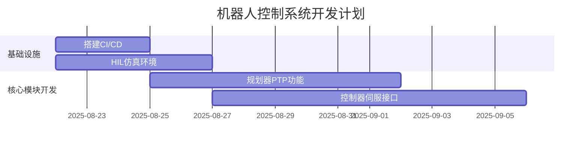

# 机器人控制系统全套技术文档模板


您好！非常理解您的需求。一套结构化、标准化的技术文档是确保大型项目成功的基石。它能将宏观的技术方案转化为具体的、可执行的行动指南，确保团队成员对目标、方法和标准有统一的认知，从而高效协作。


根据您的要求，我为您精心编制了一套完整的技术文档模板。这套文档覆盖了从需求设计到开发、测试、部署及运维的全过程，并针对您提到的“做什么”、“怎么做”、“如何验证”等核心问题提供了清晰的框架和示例。


您可以将本文档作为项目启动的核心资料，分发给团队成员，并在此基础上进行填充和细化，以形成符合您项目具体情况的最终文档。


---


### 文档导航


**一、 需求与设计类文档（指导 “做什么” 和 “怎么做”）**

* [1. 详细需求规格说明书 (SRS)](#srs)

* [2. 技术架构设计文档](#architecture)

* [3. 模块详细设计文档](#module-design)


**二、 开发与协作类文档（指导 “如何分工和推进”）**

* [4. 开发计划与任务分解表](#dev-plan)

* [5. 代码规范与命名约定](#coding-style)

* [6. 接口协议文档](#api)


**三、 测试与验证类文档（指导 “如何确保做对”）**

* [7. 测试计划与用例](#test-plan)

* [8. 验收测试标准](#acceptance-criteria)


**四、 部署与运维类文档（指导 “如何落地和维护”）**

* [9. 部署手册](#deployment-manual)

* [10. 运维手册](#ops-manual)

## <a id="srs">1. 详细需求规格说明书 (SRS)</a>


**目的**：将整体方案中的宏观需求细化为清晰、无歧义、可测试、可执行的功能点和非功能性要求，作为后续设计、开发和测试的唯一依据。


---


**1. 引言**

   1.1. **项目背景**：简述项目的来源、目标及价值。例如：`为实现XX型号机械臂在自动化产线上的高精度、智能化操作，特开发本控制系统...`

   1.2. **文档目的**：说明本文档的作用、读者和范围。

   1.3. **术语与缩写**：定义文档中使用的专业术语和缩写，如 `TCP: Trajectory Control Point`, `MAE: Motion Analysis Engine`。


**2. 总体描述**

   2.1. **产品愿景**：描述系统的最终形态和核心能力。

   2.2. **系统上下文**：使用框图说明系统与外部环境（如用户、上位机、传感器、执行器）的交互关系。

   2.3. **主要功能列表**：

      * `FL-01`: 轨迹规划

      * `FL-02`: 运动控制

      * `FL-03`: 状态监控与数据采集

      * `FL-04`: 异常检测与安全停机

      * ...


**3. 功能需求 (Functional Requirements)**


   * **FR-1: 轨迹规划模块**

     * `FR-1.1`: 支持点对点（PTP）运动规划。

     * `FR-1.2`: 支持直线（Line）和圆弧（Circle）轨迹插补。

     * `FR-1.3`: 规划器必须能够进行碰撞检测，并重新规划安全路径。

     * ...


   * **FR-2: 运动控制模块**

     * `FR-2.1`: 控制器应能以 `1ms` 的周期执行运动指令。

     * `FR-2.2`: 支持力矩控制和位置控制模式的切换。

     * ...


**4. 非功能需求 (Non-Functional Requirements)**


   * **NFR-1: 性能需求**

     * `NFR-1.1`: **响应时间**：从接收指令到机械臂开始运动的延迟应小于 `10ms`。

     * `NFR-1.2`: **定位精度**：末端执行器重复定位精度需达到 `±0.02mm`。


   * **NFR-2: 可靠性需求**

     * `NFR-2.1`: **平均无故障时间 (MTBF)**：系统核心服务 MTBF 不低于 `10,000` 小时。


   * **NFR-3: 安全性需求**

     * `NFR-3.1`: 系统必须集成紧急停止（E-Stop）回路，接收到信号后 `50ms` 内切断所有电机电源。


**5. 接口需求**

   5.1. **硬件接口**：与伺服驱动器、I/O 模块、视觉传感器的接口类型、协议和参数。

   5.2. **软件接口**：与上位机 HMI 通信的协议（如 TCP/IP, EtherCAT），数据格式（JSON）。

## <a id="architecture">2. 技术架构设计文档</a>


**目的**：定义系统的高层结构、技术选型和设计原则，确保技术方案的合理性、可扩展性和可维护性，指导各模块的详细设计。


---


**1. 引言**

   1.1. **设计目标**：阐述架构设计需要满足的核心目标，如 `高实时性`、`模块化`、`可移植性`。


**2. 架构概述**

   2.1. **架构风格**：说明选择的架构模式。例如：`本系统采用分层架构，自下而上分为硬件抽象层、核心服务层和应用接口层，并通过消息总线（Message Bus）实现层间和模块间解耦。`

   2.2. **系统架构图**：提供高层次的系统组件图，清晰展示主要模块（如规划器、控制器、MAE 引擎、通信网关）及其相互关系。


**3. 技术选型**

   * **操作系统**：`Ubuntu 22.04 + PREEMPT_RT` 实时内核（理由：保证控制任务的确定性调度）。

   * **编程语言**：

      * 核心控制与规划：`C++ 20` (理由：高性能、面向对象、丰富的库支持)

      * 应用接口与工具：`Python 3.10` (理由：开发效率高，生态丰富)

   * **核心框架/库**：`ROS 2` (理由：提供标准的机器人应用开发框架、通信机制和工具链), `Eigen` (理由：高效的线性代数计算)。

   * **通信中间件**：`DDS (Data Distribution Service)` (理由：ROS 2 默认通信系统，提供实时的、可靠的发布/订阅模型)。


**4. 模块划分与职责**

   * **硬件抽象层 (HAL)**

      * **职责**：封装对具体硬件（电机、编码器）的访问，为上层提供统一的接口。

      * **关键设计**：采用插件式驱动加载机制。

   * **核心服务层**

      * **规划器 (Planner)**：接收任务，生成运动轨迹。

      * **控制器 (Controller)**：实时跟踪轨迹，计算并发送电机指令。

      * **MAE 引擎 (Motion Analysis Engine)**：订阅系统状态，进行运动学/动力学分析和故障诊断。

   * **应用接口层**

      * **职责**：提供外部访问接口（如 HTTP API），并进行指令解析与校验。


**5. 关键设计决策**

   5.1. **数据流**：描述一个典型任务（如“从A点移动到B点”）的数据如何在系统中流动，从指令输入到电机执行的全过程。

   5.2. **错误处理机制**：定义系统级的错误码、异常传递方式和统一的日志记录规范。

   5.3. **配置管理**：说明系统配置（如机器人模型参数、控制器增益）的存储格式（YAML）和加载机制。

## <a id="module-design">3. 模块详细设计文档 (以“规划器”为例)</a>


**目的**：深入每个核心模块的内部，说明其数据结构、算法、类设计和内部逻辑，为具体的编码工作提供直接指导。


---


**1. 模块概述**

   1.1. **职责**：规划器的核心职责是根据用户输入的目标点和约束（速度、加速度），生成一条平滑、无碰撞且运动学可达的轨迹。

   1.2. **接口**：

      * **输入**：`PlanRequest` (目标姿态、运动类型、速度/加速度限制)

      * **输出**：`Trajectory` (一系列包含位置、速度、加速度的时间戳路径点)


**2. 核心数据结构**

   ```cpp

   // 路径点定义

   struct Waypoint {

       double timestamp_sec;

       std::vector<double> joint_positions;

       std::vector<double> joint_velocities;

       std::vector<double> joint_accelerations;

   };


   // 轨迹定义

   using Trajectory = std::vector<Waypoint>;

   ```


**3. 主要类设计**


   * **`PlannerService`**: 

      * **职责**: 对外提供规划服务的ROS 2节点。

      * **方法**: `handle_plan_request()`

   * **`TrajectoryGenerator`**:

      * **职责**: 核心轨迹生成逻辑。

      * **方法**: `generatePTP(start, end)`, `generateLine(start, end)`

   * **`CollisionDetector`**:

      * **职责**: 检查给定轨迹是否与环境发生碰撞。

      * **方法**: `check(trajectory)`


**4. 关键算法与逻辑**


   * **PTP 规划流程 (时序图)**

     1. `PlannerService` 收到请求。

     2. 调用逆运动学求解器 `IK_Solver` 计算目标关节角。

     3. 实例化 `TrajectoryGenerator`，在关节空间使用五次多项式插值算法生成初始轨迹。

     4. 将轨迹传入 `CollisionDetector` 进行碰撞检测。

     5. 如果检测到碰撞，尝试使用 RRT* 等避障算法重新规划。

     6. 返回最终轨迹。


   * **核心算法**：`五次多项式插值 (Quintic Polynomial Interpolation)`

      * **描述**：该算法能确保在起点和终点的位置、速度、加速度均为已知的情况下，生成一条连续、平滑的曲线。

      * **公式**：

        $$ q(t) = c_0 + c_1t + c_2t^2 + c_3t^3 + c_4t^4 + c_5t^5 $$


**5. 错误处理**

   * **`E_IK_NO_SOLUTION`**: 逆运动学无解。

   * **`E_PLAN_IN_COLLISION`**: 规划路径与障碍物碰撞。

   * **`E_TARGET_UNREACHABLE`**: 目标点超出工作空间。

## <a id="dev-plan">4. 开发计划与任务分解表</a>


**目的**：将整个开发工作量化、分解为具体的、可跟踪的任务，并分配到人，明确时间节点，是项目进度管理的核心工具。


---


**1. 里程碑 (Milestones)**


| 里程碑 | 主要交付物 | 预计完成日期 |

| :--- | :--- | :--- |

| M1 | 技术原型验证 | 2025-09-15 |

| M2 | 核心功能开发完成 | 2025-11-01 |

| M3 | 系统集成与测试 | 2025-12-01 |

| M4 | Alpha 版本发布 | 2025-12-15 |


**2. 任务分解 (Work Breakdown Structure)**


| 任务ID | 任务描述 | 负责人 | 预估工时(人天) | 前置依赖 | 状态 |

| :--- | :--- | :--- | :--- | :--- | :--- |

| **Phase 1: 基础设施** | | | | | |

| T-101 | 搭建CI/CD流水线 | 张三 | 3 | - | `未开始` |

| T-102 | 硬件在环(HIL)仿真环境配置 | 李四 | 5 | - | `未开始` |

| **Phase 2: 核心模块开发** | | | | | |

| T-201 | **规划器**: PTP功能实现 | 王五 | 8 | T-101 | `未开始` |

| T-202 | **规划器**: Line/Circle功能 | 王五 | 10 | T-201 | `未开始` |

| T-203 | **控制器**: 伺服接口与PID实现 | 李四 | 10 | T-102 | `未开始` |

| T-204 | **MAE引擎**: 运动学正逆解模块 | 赵六 | 8 | - | `进行中` |

| **Phase 3: 集成与测试** | | | | | |

| T-301 | 规划器与控制器集成 | 王五, 李四| 5 | T-202, T-203 | `未开始` |


**3. 资源计划**

   * **开发人员**：张三 (DevOps), 李四 (控制), 王五 (规划), 赵六 (算法)

   * **硬件资源**：2套开发套件，1台高性能仿真服务器


**4. GANTT 图**

   *（此处可嵌入GANTT图，如使用 Mermaid.js）*




## <a id="coding-style">5. 代码规范与命名约定</a>


**目的**：统一团队的编码风格，降低沟通成本，提高代码的可读性、可维护性和健壮性。


---


**1. 通用原则**

   * **清晰性优先**：代码首先是给人读的，其次才是给机器执行的。禁止使用过于晦涩的技巧。

   * **一致性**：遵循本文档定义的规范，保持整个项目代码风格一致。

   * **注释**：对复杂的业务逻辑、算法或非常规操作必须添加注释。


**2. 命名规范 (C++)**

   * **类/结构体 (Classes/Structs)**：`PascalCase`, e.g., `TrajectoryPlanner`。

   * **函数/方法 (Functions/Methods)**：`camelCase`, e.g., `calculateInverseKinematics`。

   * **变量 (Variables)**：

      * 局部变量：`camelCase`, e.g., `maxVelocity`。

      * 全局/常量：`ALL_CAPS_WITH_UNDERSCORE`, e.g., `MAX_JOINT_COUNT`。

      * 私有成员变量：`m_` 前缀，e.g., `m_isActive`。

   * **枚举 (Enums)**：`PascalCase` for enum type, `ALL_CAPS` for values, e.g., `enum class Status { OK, FAILED };`


**3. 代码格式**

   * **缩进**：使用4个空格，禁止使用Tab。

   * **行宽**：每行代码不超过120个字符。

   * **大括号**：左大括号不换行 (K&R风格)。

     ```cpp

     class MyClass {

     public:

         void doSomething() {

             if (condition) {

                 // ...

             }

         }

     };

     ```


**4. C++ 最佳实践**

   * **头文件**：使用 `#pragma once` 防止重复包含。

   * **智能指针**：优先使用 `std::unique_ptr` 和 `std::shared_ptr` 管理动态内存。

   * **Const 正确性**：尽可能使用 `const` 关键字修饰不应被修改的变量和方法。

   * **错误处理**：优先使用异常（Exceptions）处理错误，而不是返回错误码。


**5. Git 提交规范**

   * 每次提交必须关联一个任务ID。

   * 提交信息格式：`<type>(<scope>): <subject>`

      * `feat`: 新功能

      * `fix`: Bug修复

      * `docs`: 文档变更

      * `refactor`: 代码重构

   * **示例**：`feat(planner): T-201 Implement PTP trajectory generation`

## <a id="api">6. 接口协议文档</a>


**目的**：定义模块间或系统与外部的交互方式、协议和数据格式，是并行开发和后期集成的基础。


---


### 通信协议：ROS 2 Service & Topic


**1. `/planner_service/plan_trajectory` (Service)**


   * **功能描述**：请求规划器生成一条运动轨迹。

   * **服务类型**：`custom_interfaces/srv/PlanTrajectory`

   * **Request (请求数据)**:


| 字段名 | 类型 | 描述 | 示例 |

| :--- | :--- | :--- | :--- |

| `target_pose` | `geometry_msgs/Pose` | 目标末端位姿 | `{position: {x:0.5, y:0.1, z:0.4}, ...}` |

| `motion_type` | `string` | 运动类型 ("PTP", "Line") | `"PTP"` |

| `max_velocity`| `double` | 最大速度 (m/s 或 rad/s) | `0.25` |

| `max_accel` | `double` | 最大加速度 | `1.2` |


   * **Response (响应数据)**:


| 字段名 | 类型 | 描述 |

| :--- | :--- | :--- |

| `success` | `bool` | 规划是否成功 |

| `trajectory`| `trajectory_msgs/JointTrajectory` | 生成的轨迹 |

| `error_message` | `string` | 规划失败时的错误信息 |


---


**2. `/robot_state` (Topic)**


   * **功能描述**：实时广播机器人的状态。

   * **消息类型**：`sensor_msgs/JointState`

   * **发布者**：`Controller`

   * **订阅者**：`Planner`, `MAE Engine`, `HMI`

   * **发布频率**：`100 Hz`

   * **消息内容**:


| 字段名 | 类型 | 描述 |

| :--- | :--- | :--- |

| `header.stamp` | `builtin_interfaces/Time`| 时间戳 |

| `name` | `string[]` | 关节名称数组 |

| `position` | `double[]` | 关节角度数组 (rad) |

| `velocity` | `double[]` | 关节速度数组 (rad/s)|

| `effort` | `double[]` | 关节力矩数组 (Nm) |

## <a id="test-plan">7. 测试计划与用例</a>


**目的**：规划测试活动，设计具体的测试用例，系统性地验证产品功能是否满足需求规格，保证软件质量。


---


**1. 测试策略**

   * **单元测试**：针对核心类和函数，由开发者编写，使用 `GTest` 框架。

   * **集成测试**：测试模块间的接口和数据交互，在`HIL`仿真环境中进行。

   * **系统测试**：在真实机器人上，对整个系统功能、性能和可靠性进行端到端测试。

   * **回归测试**：每次代码变更后，自动运行一套核心用例，确保未引入新问题。


**2. 测试环境**

   * **软件**：Ubuntu 22.04, ROS 2 Humble, Gazebo 11 (仿真)

   * **硬件**： UR5e 机器人，Intel NUC i7 控制主机


**3. 测试范围**

   * 功能测试、性能测试、压力测试、安全测试。


**4. 测试用例 (Test Cases)**


| 用例ID | 模块 | 测试描述 | 前置条件 | 测试步骤 | 预期结果 |

| :--- | :--- | :--- | :--- | :--- | :--- |

| **TC-PLAN-001**| 规划器| **点对点(PTP)规划-正常场景** | 1. 机器人已上电使能<br>2. 起点和终点均在工作空间内且无障碍 | 1. 请求规划服务，输入合法的起点和终点<br>2. 监控响应 | 1. 服务返回`success=true`<br>2. 返回的轨迹点数大于0<br>3. 轨迹平滑，无速度突变 |

| **TC-PLAN-002**| 规划器| **点对点(PTP)规划-目标不可达** | 1. 机器人已上电使能 | 1. 请求规划服务，输入一个工作空间外的目标点 | 1. 服务返回`success=false`<br>2. `error_message` 为 "Target unreachable" |

| **TC-CTRL-001**| 控制器| **轨迹跟踪精度** | 1. 规划器生成一段已知轨迹 | 1. 命令控制器执行该轨迹<br>2. 记录实际关节角度 | 1. 实际轨迹与目标轨迹的最大误差小于`0.1`度 |

| **TC-SYS-001** | 系统 | **紧急停止功能** | 1. 机器人在高速运行中 | 1. 触发物理急停按钮 | 1. 机器人在`50ms`内停止运动<br>2. 系统状态变为`FAULT` |

## <a id="acceptance-criteria">8. 验收测试标准</a>


**目的**：提供一个明确的、可量化的“完成”标准列表。当所有标准均满足时，项目可被视为正式完成并交付。


---


| 类别 | 标准ID | 验收标准描述 | 验证方法 | 状态 |

| :--- | :--- | :--- | :--- | :--- |

| **功能完整性**| AC-FUNC-01 | 所有 SRS 中定义的功能需求均已实现。 | 运行所有系统测试用例，覆盖率100%。 | `未满足` |

| | AC-FUNC-02 | 系统能够连续无故障地执行典型的作业流程（抓取-放置）100次。 | 现场演示或视频记录。 | `未满足` |

| **性能指标**| AC-PERF-01 | 末端重复定位精度测试结果达到 `±0.02mm`。 | 使用激光跟踪仪进行测量，提供测试报告。 | `未满足` |

| | AC-PERF-02 | 满负载情况下，CPU 和内存使用率均低于 75%。 | 运行压力测试，并使用`htop`等工具监控。 | `未满足` |

| **可靠性**| AC-RELY-01 | 系统能连续稳定运行 `72` 小时，无核心服务崩溃或死机。 | 长期运行测试。 | `未满足` |

| **安全性**| AC-SAFE-01 | 紧急停止、碰撞检测等安全相关功能按设计要求正常工作。 | 物理测试和故障注入测试。 | `未满足` |

| **文档交付**| AC-DOCS-01 | 所有本文档清单中列出的技术文档都已完成撰写和评审。 | 文档审查。 | `未满足` |


**验收流程**

1.  **开发方自检**：开发团队根据此标准完成内部测试并提交报告。

2.  **用户方验收**：用户或其代表在开发方的协助下，按照“验证方法”逐项确认。

3.  **签署验收报告**：所有标准均满足后，双方签署项目验收报告。

## <a id="deployment-manual">9. 部署手册</a>


**目的**：为现场实施工程师或用户提供一步一步的清晰指引，确保软件在目标硬件上被正确、一致地安装和配置。


---


**1. 环境要求**

   * **硬件**:

      * 控制计算机: Intel NUC (i7-1165G7, 16GB RAM, 256GB NVMe SSD)

      * 网络: 千兆以太网，静态 IP `192.168.1.100`

   * **软件**:

      * 操作系统: 已预装 `Ubuntu 22.04 LTS`

      * BIOS 设置: `Intel VT-d` 已禁用


**2. 部署前准备**

   2.1. **安装基础依赖**:

      ```bash

      sudo apt update

      sudo apt install git build-essential cmake python3-pip -y

      ```

   2.2. **安装 ROS 2 Humble**:

      *（此处引用ROS 2官方安装脚本或步骤）*


**3. 部署步骤**

   3.1. **获取代码**:

      ```bash

      mkdir -p ~/ros2_ws/src

      cd ~/ros2_ws/src

      git clone <your_project_git_repository_url>

      ```


   3.2. **编译代码**:

      ```bash

      cd ~/ros2_ws

      rosdep install --from-paths src -y --ignore-src

      colcon build --symlink-install

      ```


   3.3. **配置环境变量**:

      ```bash

      echo "source ~/ros2_ws/install/setup.bash" >> ~/.bashrc

      source ~/.bashrc

      ```


   3.4. **配置系统参数**:

      * 复制 `config/robot_params.yaml` 到 `/etc/robot_config/`。

      * 修改配置文件中的机器人序列号和IP地址。


**4. 启动与验证**

   4.1. **启动核心服务**:

      ```bash

      ros2 launch my_robot_bringup robot.launch.py

      ```


   4.2. **验证**:

      * 新开一个终端，执行 `ros2 topic list`，应能看到 `/robot_state` 等话题。

      * 执行 `ros2 topic echo /robot_state`，应能看到实时数据输出。


**5. 回滚方案**

   * 如部署失败，可执行 `git checkout <previous_working_commit_hash>` 回退到上一个稳定版本，然后重新执行部署步骤 3.2 至 4.2。

## <a id="ops-manual">10. 运维手册</a>


**目的**：为系统运行和维护人员提供日常操作指南，包括如何监控系统状态、诊断常见问题以及如何进行数据备份与恢复。


---


**1. 日常监控**

   * **核心服务状态检查**:

     * **命令**: `systemctl status robot-core.service`

     * **正常状态**: 显示 `active (running)`

   * **系统资源监控**:

     * **命令**: `htop`

     * **关注指标**: CPU 使用率不应持续高于 80%，可用内存不应低于 500MB。

   * **日志查看**:

     * **实时日志**: `journalctl -u robot-core.service -f`

     * **关键日志路径**: `/var/log/robot_logs/`


**2. 常见故障排查 (Troubleshooting)**


| 故障现象 | 可能原因 | 解决方案 |

| :--- | :--- | :--- |

| **机器人无法连接** | 1. 网络线缆松动或损坏。<br>2. 机器人IP配置错误。<br>3. 防火墙拦截。 | 1. 检查物理连接。<br>2. `ping <robot_ip>` 确认网络通畅。<br>3. 检查控制器配置文件中的IP地址是否正确。 |

| **运动规划失败，提示"IK No Solution"** | 1. 目标点超出了机器人工作空间。<br>2. 目标姿态奇异，无解。 | 1. 在 HMI 中检查目标点坐标是否合理。<br>2. 尝试微调目标点的姿态角度。 |

| **服务启动失败** | 1. 配置文件缺失或格式错误。<br>2. 端口被占用。 | 1. 检查 `/etc/robot_config/` 目录下的 `.yaml` 文件是否存在且语法正确。<br>2. 使用 `netstat -tulnp` 检查端口占用情况。|


**3. 数据备份与恢复**

   * **需要备份的数据**:

      * 系统配置文件: `/etc/robot_config/`

      * 生产日志与数据: `/var/log/robot_logs/`, `/var/data/production_data/`

   * **备份方法**:

      * 编写一个`shell`脚本，使用`tar`命令将上述目录打包，并加上日期戳。

      * 使用 `crontab` 设置定时任务，每天凌晨2点自动执行备份脚本，并将备份文件传输到远程服务器。

      ```bash

      # crontab -e

      0 2 * * * /usr/local/bin/backup_robot_data.sh

      ```

   * **恢复方法**:

      1. 停止`robot-core`服务。

      2. 将备份文件从远程服务器取回，解压并覆盖相应目录。

      3. 重启`robot-core`服务。